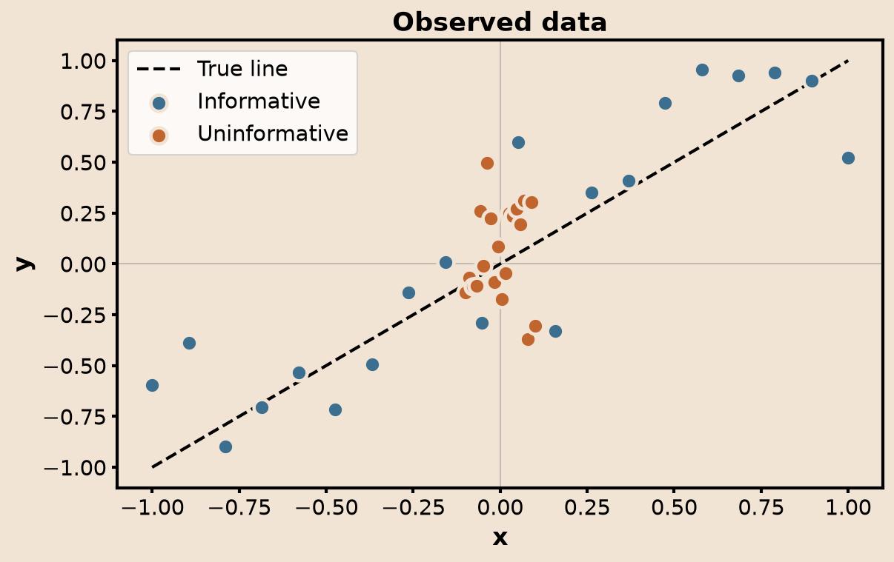
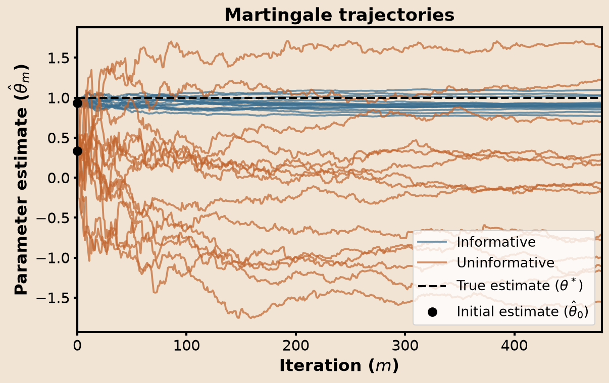
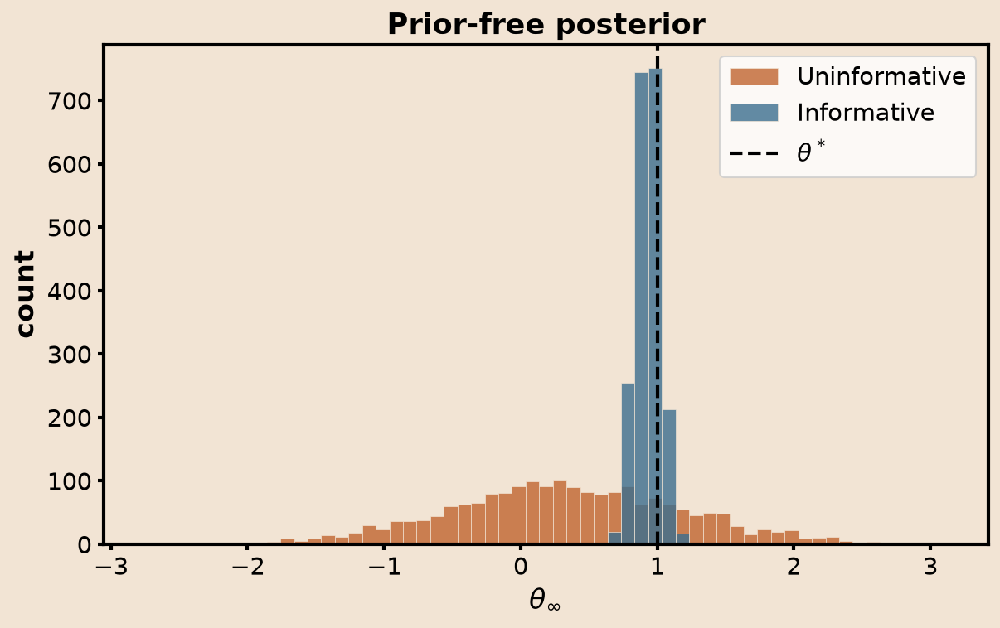

# martingale_tutorial

Demo of prior-free uncertainty quantification via martingales, for a simple
linear model with an unknown slope. Companion code for Part 2 of the blog
post, at `content/research/martingale2.md` in `fernandopalafox.github.io`.

<p align="center">
  
  
  
</p>

## Setup

```
uv sync
```

## Run

```
uv run scripts/generate_linear.py --config config/default.toml
uv run scripts/run_martingale.py --config config/default.toml
uv run scripts/plot_results.py --config config/default.toml

uv run scripts/generate_linear.py --config config/uninformative.toml
uv run scripts/run_martingale.py --config config/uninformative.toml
uv run scripts/plot_results.py --config config/uninformative.toml

uv run scripts/plot_comparison.py
```

Each run draws a small linear dataset, runs `N` independent martingale
trajectories that resample from it and update the slope estimate in closed
form (recursive least squares, no learning rate to tune), and plots the
data, trajectories, and a `theta_infty` histogram — a posterior over the
slope with no prior involved.

`config/default.toml` (label `informative`) samples `x` from `[-1, 1]`;
`config/uninformative.toml` samples from a much narrower `[-0.1, 0.1]`, so
the martingale procedure gets far less information per observation. Both
use the same noise level, so the two runs differ only in what's sampled.
Outputs are namespaced by the config's `label`, e.g. `data/dataset_informative.npz`.

`scripts/plot_comparison.py` overlays both runs (informative in blue,
uninformative in orange) into the three figures above.

## Layout

- `config/` — TOML run parameters, each with a `label` for namespacing outputs.
- `scripts/generate_linear.py` — draws synthetic `(x, y)` data from a known linear model.
- `scripts/run_martingale.py` — runs the martingale procedure.
- `scripts/plot_results.py` — plots data/trajectories/histogram for one config.
- `scripts/plot_comparison.py` — overlays the informative and uninformative runs.
- `data/` — generated datasets and results (gitignored, regenerate anytime).
- `figures/` — output PNGs.
